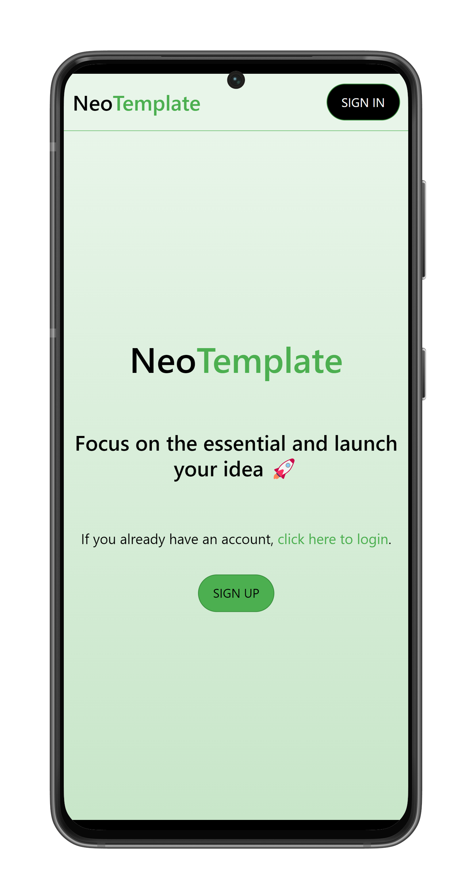
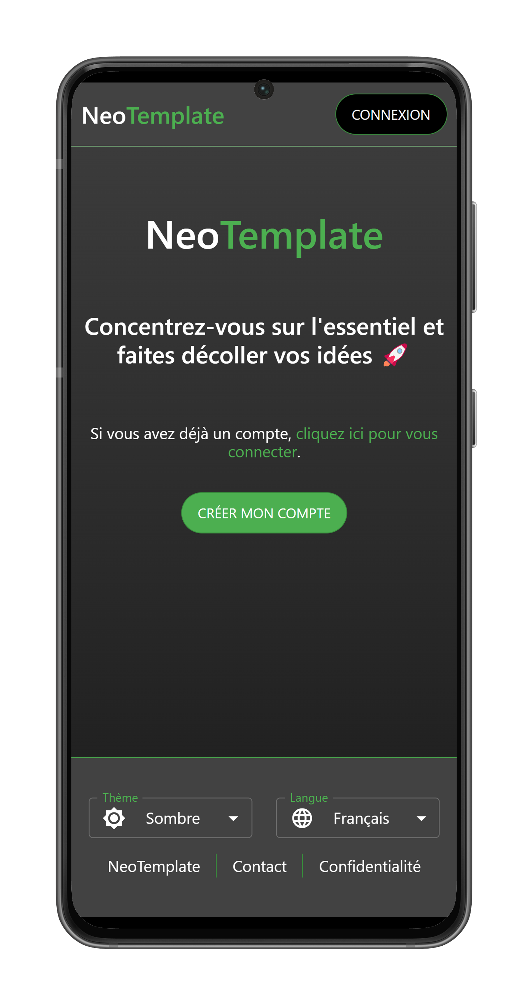

# NeoTemplate

NeoTemplate is a full-stack website template built using Next.js with Material UI, NextAuth, and i18next for the frontend, and Django with Django Rest Framework (DRF) for the backend. It provides a foundation for creating websites with essential features already implemented, including:

- Email-based sign-in/sign-up
- Email validation
- Password reset functionality
- Profile management with profile picture upload
- A basic home page
- Theme (light/dark) selection (stored client-side)
- Language selection (stored client-side)

<br>


<p align="center">


</p>


## Installation

- Right-click this button to create a repository using this one as a template.

[](https://github.com/new?template_owner=thomassimmers&template_name=NeoTemplate&owner=%40me&name=NeoTemplate&description=My+clone+repository&visibility=public)

- Ensure you have Docker and Docker Compose installed.
- Create `.env` files in the `backend/` and `frontend/` folders and populate them using the respective `.env.template` files.

### Local

```bash
docker-compose up --build -d
```

### Production

```bash
docker-compose -f docker-compose.prod.yml up --build -d
```

If Docker encounters permission issues:

```bash
sudo chown -R $(id -u):$(id -g) $HOME/.docker
```

Then navigate to: [http://localhost:3000/](http://localhost:3000/)

## Admin Panel

To access the Django admin panel, create a superuser within your backend container:

```bash
docker exec -it backend bash
python manage.py createsuperuser
```

Then navigate to: [http://localhost:8000/admin/](http://localhost:8000/admin/)

## What do I need to start from here ?

1. Change every occurence of `NeoTemplate`, `neotemplate`, `Neo` and `Template` by your desired name.
2. Change the logo at `frontend/public/favicon.ico`, `frontend/public/logo.png` and at `frontend/components/icons/logo.png`.

And that's it, start implementing your ideas!

## Troubleshooting

- You do not have email server to set in the .env file ?

1. Uncomment these lines in backend/core/settings.py :

```python
# if DEBUG:
#     EMAIL_BACKEND = 'django.core.mail.backends.console.EmailBackend'
```

2. In the same file, set `ACCOUNT_EMAIL_VERIFICATION` to `False`.
3. Restart the `backend`container with:

```bash
docker restart backend
```
