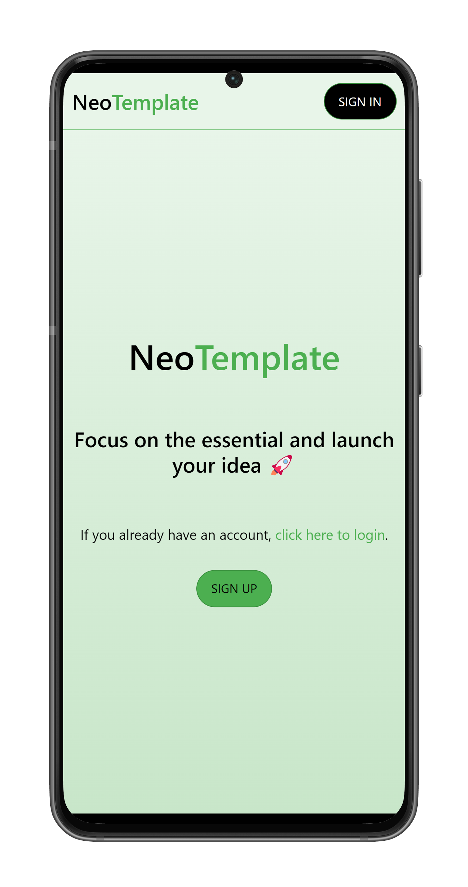
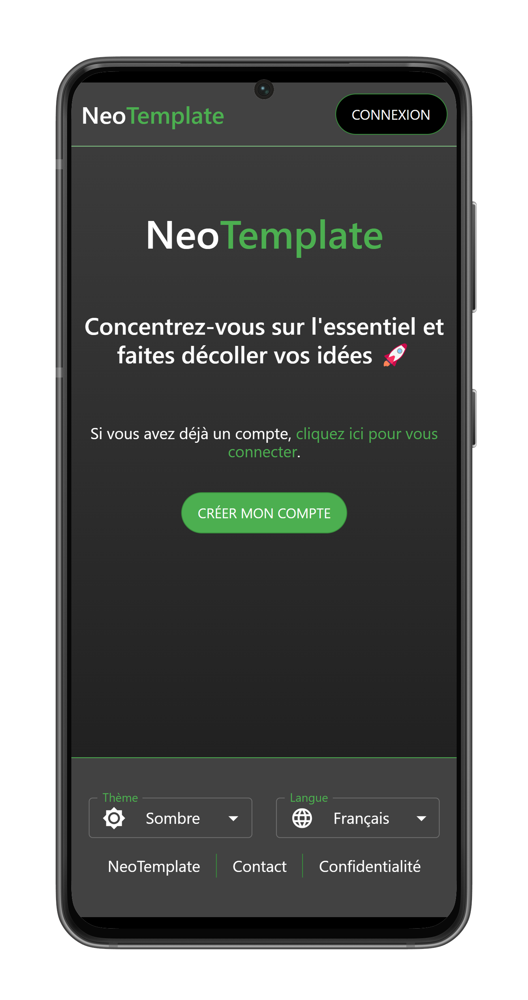

# NeoTemplate

NeoTemplate is a full-stack website template built using Next.js with Material UI, NextAuth, and i18next for the frontend, and Django with Django Rest Framework (DRF) for the backend. It provides a foundation for creating websites with essential features already implemented, including:

- Email-based sign-in/sign-up
- Email validation
- Password reset functionality
- Profile management with profile picture upload
- A basic home page
- Theme (light/dark) selection (stored client-side)
- Language selection (stored client-side)

<br>


<p align="center">


</p>

## Prerequisites

Before you begin, ensure you have the following installed:

- **Docker** (version 20.10 or higher)
- **Docker Compose** (version 2.0 or higher)

To verify your installation:

```bash
docker --version
docker compose version
```

## Installation

### Step 1: Clone or Use Template

Right-click this button to create a repository using this one as a template:

[](https://github.com/new?template_owner=thomassimmers&template_name=NeoTemplate&owner=%40me&name=NeoTemplate&description=My+clone+repository&visibility=public)

Or clone the repository:

```bash
git clone <your-repo-url>
cd NeoTemplate
```

### Step 2: Environment Configuration

Create `.env` files in both `backend/` and `frontend/` directories with the required environment variables.

#### Backend Environment Variables (`backend/.env`)

Create `backend/.env` with the following variables:

```env
# Django Settings
SECRET_KEY=your-secret-key-here
DEBUG=1
FRONTEND_HOST=http://localhost:3000

# Database Configuration
SQL_ENGINE=django.db.backends.postgresql
POSTGRES_DB=neotemplate
POSTGRES_USER=postgres
POSTGRES_PASSWORD=your-db-password
POSTGRES_HOST=db
POSTGRES_PORT=5434

# JWT Configuration
JWT_SECRET_KEY=your-jwt-secret-key-here

# Email Configuration (for production, use real SMTP settings)
EMAIL_HOST=smtp.gmail.com
EMAIL_HOST_USER=your-email@gmail.com
EMAIL_HOST_PASSWORD=your-email-password
```

**Note:** For local development without an email server, see the [Troubleshooting](#troubleshooting) section below.

#### Frontend Environment Variables (`frontend/.env`)

Create `frontend/.env` with the following variables:

```env
NEXT_PUBLIC_BACKEND_URL=http://localhost:8000
NEXT_PRIVATE_BACKEND_URL=http://localhost:8000
NEXTAUTH_URL=http://localhost:3000
NEXTAUTH_SECRET=your-nextauth-secret-here
```

**Security Note:** Generate secure random strings for `SECRET_KEY`, `JWT_SECRET_KEY`, and `NEXTAUTH_SECRET`. You can use:

```bash
# Generate a secure random string
python3 -c "import secrets; print(secrets.token_urlsafe(32))"
```

## Running the Application

### Local Development

For local development with hot-reload enabled:

```bash
docker compose up --build -d
```

This will:

- Build the Docker images for all services
- Start the database, backend, and frontend containers
- Enable hot-reload for both frontend and backend (code changes will be reflected automatically)

**Access the application:**

- Frontend: [http://localhost:3000](http://localhost:3000)
- Backend API: [http://localhost:8000](http://localhost:8000)
- Django Admin: [http://localhost:8000/admin](http://localhost:8000/admin)

### Production

For production deployment:

```bash
docker compose -f docker-compose.prod.yml up --build -d
```

**Production differences:**

- Frontend is built and optimized (no hot-reload)
- Backend runs without reload flag
- No volume mounts (code is baked into images)
- Smaller, optimized Docker images

**Important:** Before deploying to production:

1. Set `DEBUG=0` in `backend/.env`
2. Update `FRONTEND_HOST` and `NEXTAUTH_URL` with your production domain
3. Configure proper email SMTP settings
4. Update `ALLOWED_HOSTS` in `backend/core/settings.py` with your domain
5. Use strong, unique secrets for all keys

### Docker Permission Issues (Linux)

If you encounter permission issues with Docker:

```bash
sudo chown -R $(id -u):$(id -g) $HOME/.docker
```

Or add your user to the docker group:

```bash
sudo usermod -aG docker $USER
# Then log out and log back in
```

## Common Commands

### View Logs

View logs for all services:

```bash
docker compose logs -f
```

View logs for a specific service:

```bash
docker compose logs -f backend
docker compose logs -f frontend
docker compose logs -f db
```

### Stop Services

```bash
docker compose down
```

Stop and remove volumes (⚠️ **WARNING:** This will delete your database):

```bash
docker compose down -v
```

### Restart a Service

```bash
docker compose restart backend
docker compose restart frontend
```

### Execute Commands in Containers

Access the backend container shell:

```bash
docker exec -it backend bash
```

Access the frontend container shell:

```bash
docker exec -it frontend sh
```

### Rebuild After Changes

If you modify Dockerfiles or dependencies:

```bash
docker compose up --build -d
```

## Admin Panel

To access the Django admin panel, create a superuser:

```bash
docker exec -it backend python manage.py createsuperuser
```

Follow the prompts to create your admin account, then navigate to: [http://localhost:8000/admin](http://localhost:8000/admin)

### Run Django Management Commands

```bash
# Make migrations
docker exec -it backend python manage.py makemigrations

# Apply migrations
docker exec -it backend python manage.py migrate

# Collect static files
docker exec -it backend python manage.py collectstatic
```

## What do I need to start from here ?

1. Change every occurence of `NeoTemplate`, `neotemplate`, `Neo` and `Template` by your desired name.
2. Change the logo at `frontend/public/favicon.ico`, `frontend/public/logo.png` and at `frontend/components/icons/logo.png`.

And that's it, start implementing your ideas!

## Troubleshooting

### Email Server Not Configured

If you don't have an email server configured for local development:

1. Open `backend/core/settings.py`
2. Uncomment these lines (around line 205-206):

```python
if DEBUG:
    EMAIL_BACKEND = 'django.core.mail.backends.console.EmailBackend'
```

3. Set `ACCOUNT_EMAIL_VERIFICATION` to `"none"` (around line 218):

```python
ACCOUNT_EMAIL_VERIFICATION = "none"  # Change from "mandatory"
```

4. Restart the backend container:

```bash
docker compose restart backend
```

Emails will now be printed to the console instead of being sent.
